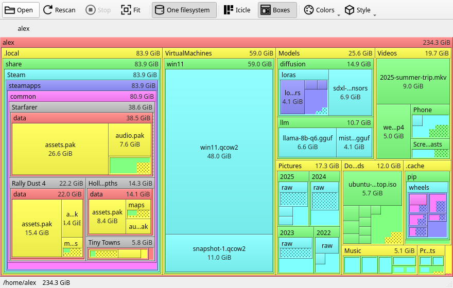
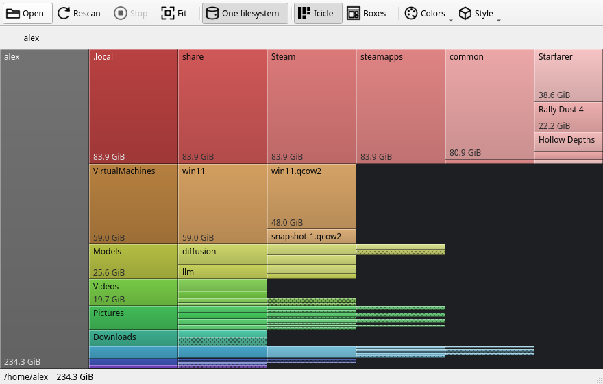

# SpaceQuilt

SpaceQuilt shows disk usage in two views:

- **Boxes**, after SpaceMonger: each directory is a titled box, with its
  children packed inside it, down to the files. You see a whole volume as one
  nested map.
- **Icicle**, after [xdiskusage](https://xdiskusage.sourceforge.net/):
  columns sized by bytes, one per depth. You click a block to drill into it,
  as in the Android *DiskUsage* app.





The two views share the scan, the colours, drill-down and zoom, and you can
switch between them at any time. SpaceQuilt runs on Qt6 (PySide6) and follows
your desktop theme.

SpaceQuilt has no filesystem walker of its own. Like xdiskusage, it reads the
output of `du -k --all`, and `du` takes care of hardlinks, sparse files and
block accounting.

## Requirements

- Python 3
- PySide6 (`pip install --user PySide6`, or your distro's `pyside6` package)
- `du` (coreutils)

## Usage

```sh
spacequilt [PATH] [-x | -X] [--view VIEW] [--colors SCHEME] [--style STYLE]
```

- `PATH`: the directory to scan. Without it, SpaceQuilt opens on a page that
  lists the mounted volumes with their usage and your recent scans. A
  *Browse for a folder…* button covers anything else. *Open…* (Ctrl+O) brings
  the page back.
- `-x`, `--one-filesystem` (default): stop at mount points (`du -x`). A scan
  of `/` then measures the root filesystem alone, without the other disks,
  `/proc` or `/sys`.
- `-X`, `--cross-filesystems`: descend into every filesystem mounted below
  `PATH`.
- `--view boxes|icicle`: the view to start in. Boxes is the default.
- `--colors branches|levels|rainbow`: the colour scheme of the starting view.
  Each view keeps its own scheme: boxes starts with *levels*, icicle with
  *branches*.
- `--style flat|raised|deep`: the relief of the blocks. *Raised* (default)
  adds a light top and left edge, a dark bottom and right edge, a soft
  gradient and, in the boxes view, sunken content areas. *Deep* doubles all
  of it.

SpaceQuilt remembers the view, the schemes, the style, the window size and
the maximised state between runs. The toolbar changes each of them live.

### Colour schemes

| Scheme | Look |
| --- | --- |
| `levels` (boxes default) | SpaceMonger's flat pastels: one colour per depth from the scanned root, cycling salmon, yellow, green, cyan, lavender, magenta and grey |
| `branches` (icicle default) | Each top-level entry of the focused directory gets its own hue. Deeper levels keep the hue and get lighter, with a small per-path shift so neighbouring siblings differ |
| `rainbow` | Each level spreads the hues around the wheel again. The largest child takes its parent's hue and its siblings fan out from it |

The defaults differ per view. In the boxes view, nesting hides how deep a box
sits, so the colour shows the level. In the icicle view the column
gives the depth, so the colour shows the top-level branch.

### Scanning

While `du` runs, a panel shows how many entries SpaceQuilt has read and which
directory `du` is in, with a Cancel button (Esc does the same). The bar shows
a percentage when SpaceQuilt knows the total: the used inode count of the
volume for a mount-point scan, or the entry count of your last scan of that
path. Otherwise it sweeps. On a rescan, the old tree stays on screen, dimmed.

When you scan a mount point on one filesystem, the device becomes the
outermost block, and a **Free space** block sits next to the scanned
directory, as in SpaceMonger. The status bar then shows the volume's total,
used and free space.

The *One filesystem* toolbar button (Ctrl+M) switches between `-x` and `-X`.
It asks before it rescans.

### Boxes view

A directory gets a title bar with its name and size when it has room.
SpaceQuilt packs its children inside with a squarified treemap. Files and
small directories get a centred label.

SpaceQuilt lays out each directory once and places every entry in it. When
you zoom, it scales that layout and moves nothing. The screen size decides
which boxes appear. Entries too small to draw show as the parent's
dotted area, the way SpaceMonger 2 drew them, and appear one by one as you
zoom in. SpaceQuilt draws at most a few thousand boxes per frame, which keeps
a large screen fluid.

### Icicle view

Each column holds one depth, and a block's height follows its size. Entries
too small to draw at the current zoom merge into an `N smaller items` block
in their branch's colour under a dot pattern. Zoom in and it splits up.
Double click it to open it on its own.

### Interaction

| Action | Result |
| --- | --- |
| Wheel | Zoom around the cursor |
| Shift + wheel | Icicle: zoom sizes only |
| Ctrl + wheel | Icicle: zoom depth only |
| Drag (left or middle button) | Pan |
| Click a block | Select it; the status bar shows its path and size |
| Double click a block | Drill into it (double click the focused block to go up) |
| Breadcrumb button | Jump to that ancestor |
| Backspace / Esc | Go up one level |
| Esc during a scan, Cancel, Stop | Cancel the scan and keep the previous tree |
| 0 / Ctrl+0 | Fit the focused directory to the window |
| Ctrl+1 / Ctrl+2 | Icicle / boxes view |
| Ctrl+O | Volumes, recent scans, browse |
| Ctrl+R | Rescan |
| Ctrl+M | One filesystem on or off (rescans) |
| Right click | Open in file manager, copy path |

Zoom runs from the fit inward, and panning stops at the edge of the content.
SpaceQuilt lays out the blocks in screen pixels on each frame, so zooming in
reveals deeper levels instead of magnifying the drawn ones. Drill-down and
fit animate: the view zooms until the block fills the window, then the focus
switches. Going up plays the motion in reverse.

### Screenshots

`docs/screenshots.py` renders the images above offscreen from a made-up home
directory, at the width of a GitHub README. Run it after UI changes:

```sh
python3 docs/screenshots.py
```

### Desktop integration

```sh
./install-desktop.sh            # undo with --uninstall
```

The script installs a `.desktop` entry and links `spacequilt.svg` into the
icon theme, both pointing at this checkout. Wayland compositors look up a
window's icon through its desktop id, so without the entry the task bar shows
a generic icon. The entry registers `inode/directory` as well, which gives
folders an *Open with SpaceQuilt* action.

## Status

Early. Everything works end to end. SpaceQuilt keeps the whole `du` output in
memory as Python objects. A home directory of 5.8 million entries takes about
1.8 GB of RAM, and parsing it adds about 2 seconds after `du` finishes.

## License

MIT, see [LICENSE](LICENSE).
